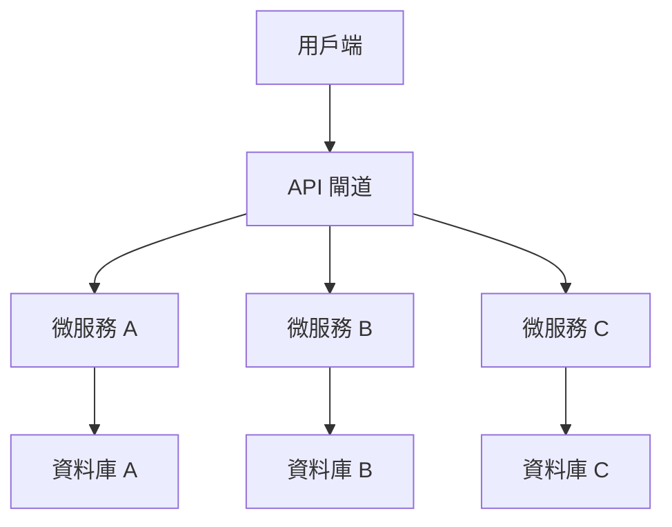
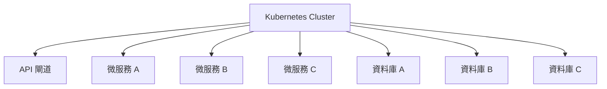

## 💡 核心能力

- **需求分析**：從功能需求中提取系統架構需求
- **架構設計**：設計符合業界標準的系統架構
- **技術選型**：根據需求選擇合適的技術棧
- **效能優化**：設計高效的系統架構和部署策略

## 🎯 適用場景

- 需要為新功能設計系統架構
- 需要優化現有系統架構
- 需要設計微服務架構
- 需要建立系統架構圖

## 📝 使用範例

### 範例 1：建立新功能系統架構

**用戶輸入**：
> 我想建立一個線上訂單系統，需要設計系統架構

**技能輸出**：
```markdown
# 系統架構設計：線上訂單系統

## 1. 架構總覽



## 2. 微服務架構

### 微服務 A：用戶服務
- 負責用戶管理
- 負責認證和授權
- 使用技術：Node.js + Express
- 資料庫：PostgreSQL

### 微服務 B：產品服務
- 負責產品管理
- 負責庫存管理
- 使用技術：Python + FastAPI
- 資料庫：MongoDB

### 微服務 C：訂單服務
- 負責訂單管理
- 負責付款處理
- 使用技術：Java + Spring Boot
- 資料庫：MySQL

## 3. API 閘道

- 負責請求路由
- 負責負載平衡
- 負責安全防護
- 使用技術：Kong API Gateway

## 4. 資料庫設計

### 資料庫 A：用戶資料庫
```sql
CREATE TABLE Customers (
    customer_id INT AUTO_INCREMENT PRIMARY KEY,
    name VARCHAR(100) NOT NULL,
    email VARCHAR(100) UNIQUE NOT NULL,
    phone VARCHAR(20),
    address TEXT,
    created_at TIMESTAMP DEFAULT CURRENT_TIMESTAMP
);
```

### 資料庫 B：產品資料庫
```sql
CREATE TABLE Products (
    product_id INT AUTO_INCREMENT PRIMARY KEY,
    name VARCHAR(100) NOT NULL,
    description TEXT,
    price DECIMAL(10, 2) NOT NULL,
    stock INT DEFAULT 0,
    created_at TIMESTAMP DEFAULT CURRENT_TIMESTAMP
);
```

### 資料庫 C：訂單資料庫
```sql
CREATE TABLE Orders (
    order_id INT AUTO_INCREMENT PRIMARY KEY,
    customer_id INT NOT NULL,
    order_date DATE NOT NULL,
    total_amount DECIMAL(10, 2) NOT NULL,
    status VARCHAR(20) DEFAULT 'pending',
    created_at TIMESTAMP DEFAULT CURRENT_TIMESTAMP,
    FOREIGN KEY (customer_id) REFERENCES Customers(customer_id)
);
```

## 5. 部署架構



## 6. 技術選型

### 前端
- React + Vite
- Tailwind CSS
- TypeScript

### 後端
- Node.js + Express
- Python + FastAPI
- Java + Spring Boot

### 資料庫
- PostgreSQL
- MongoDB
- MySQL

### 基礎設施
- Kubernetes
- Docker
- Nginx
- Redis

## 7. 效能優化

### 緩存策略
- 熱門產品緩存
- 顧客資料緩存
- 訂單狀態緩存

### 分庫分表
- 按客戶分庫
- 按時間分表
- 按區域分表

### 讀寫分離
- 主庫處理寫操作
- 從庫處理讀操作

## 8. 安全考量

- 密碼加密
- 訪問控制
- 資料加密
- SQL 注入防護

## 9. 部署考量

- 支援水平擴展
- 支援資料庫備份
- 支援監控和日誌
- 支援災難恢復

## 🔗 相關技能

- [prd](prd.md)：定義產品需求和架構需求
- [feature-spec](feature-spec.md)：編寫功能規格
- [api-design](api-design.md)：設計 API 介面
- [db-design](db-design.md)：設計資料庫結構
- [implementation](implementation.md)：建立實作規格

## 💡 提示

- 提供清晰的功能需求有助於更好的系統架構設計
- 越具體的架構需求，越容易設計
- 迭代優化是正常過程
- 保持溝通，隨時調整系統架構

## 💬 交流

如果你有任何問題或建議，請隨時提出！
```