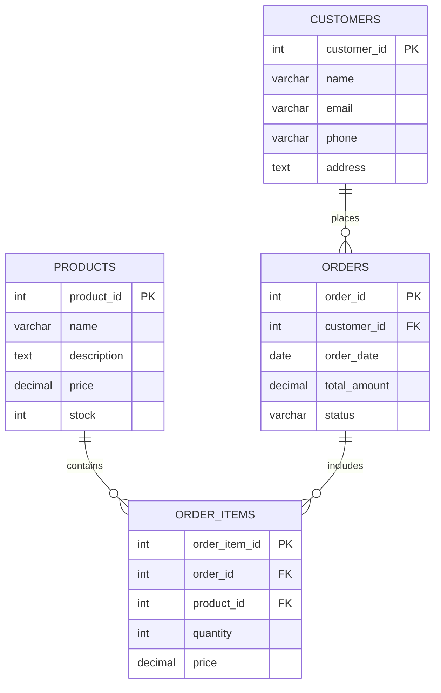

## 💡 核心能力

- **需求分析**：從功能需求中提取資料實體和關係
- **結構化輸出**：生成符合業界標準的資料庫設計
- **正規化設計**：確保資料庫結構的正規化和完整性
- **效能優化**：設計高效的索引和查詢策略

## 🎯 適用場景

- 需要為新功能設計資料庫
- 需要優化現有資料庫結構
- 需要設計資料模型和關係
- 需要建立資料庫正規化

## 📝 使用範例

### 範例 1：建立新功能資料庫設計

**用戶輸入**：
> 我想建立一個線上訂單系統，需要設計資料庫結構

**技能輸出**：
```markdown
# 資料庫設計：線上訂單系統

## 1. 資料實體

### 顧客 (Customers)
- customer_id (PK)
- name
- email
- phone
- address

### 產品 (Products)
- product_id (PK)
- name
- description
- price
- stock

### 訂單 (Orders)
- order_id (PK)
- customer_id (FK)
- order_date
- total_amount
- status

### 訂單項目 (OrderItems)
- order_item_id (PK)
- order_id (FK)
- product_id (FK)
- quantity
- price
```

## 2. 實體關係圖



## 3. 正規化

### 第一正規化 (1NF)
- 所有欄位都是原子性的
- 沒有重複群組

### 第二正規化 (2NF)
- 滿足 1NF
- 非主鍵欄位完全依賴主鍵

### 第三正規化 (3NF)
- 滿足 2NF
- 沒有傳遞依賴

## 4. 索引設計

### 常用索引
```sql
-- 顧客索引
CREATE INDEX idx_customers_email ON Customers(email);
CREATE INDEX idx_customers_phone ON Customers(phone);

-- 產品索引
CREATE INDEX idx_products_name ON Products(name);
CREATE INDEX idx_products_stock ON Products(stock);

-- 訂單索引
CREATE INDEX idx_orders_customer ON Orders(customer_id);
CREATE INDEX idx_orders_date ON Orders(order_date);
CREATE INDEX idx_orders_status ON Orders(status);

-- 訂單項目索引
CREATE INDEX idx_order_items_order ON OrderItems(order_id);
CREATE INDEX idx_order_items_product ON OrderItems(product_id);
```

## 5. SQL 建立語句

```sql
-- 顧客表
CREATE TABLE Customers (
    customer_id INT AUTO_INCREMENT PRIMARY KEY,
    name VARCHAR(100) NOT NULL,
    email VARCHAR(100) UNIQUE NOT NULL,
    phone VARCHAR(20),
    address TEXT,
    created_at TIMESTAMP DEFAULT CURRENT_TIMESTAMP
);

-- 產品表
CREATE TABLE Products (
    product_id INT AUTO_INCREMENT PRIMARY KEY,
    name VARCHAR(100) NOT NULL,
    description TEXT,
    price DECIMAL(10, 2) NOT NULL,
    stock INT DEFAULT 0,
    created_at TIMESTAMP DEFAULT CURRENT_TIMESTAMP
);

-- 訂單表
CREATE TABLE Orders (
    order_id INT AUTO_INCREMENT PRIMARY KEY,
    customer_id INT NOT NULL,
    order_date DATE NOT NULL,
    total_amount DECIMAL(10, 2) NOT NULL,
    status VARCHAR(20) DEFAULT 'pending',
    created_at TIMESTAMP DEFAULT CURRENT_TIMESTAMP,
    FOREIGN KEY (customer_id) REFERENCES Customers(customer_id)
);

-- 訂單項目表
CREATE TABLE OrderItems (
    order_item_id INT AUTO_INCREMENT PRIMARY KEY,
    order_id INT NOT NULL,
    product_id INT NOT NULL,
    quantity INT NOT NULL,
    price DECIMAL(10, 2) NOT NULL,
    FOREIGN KEY (order_id) REFERENCES Orders(order_id),
    FOREIGN KEY (product_id) REFERENCES Products(product_id)
);
```

## 6. 查詢範例

### 查詢某顧客的所有訂單
```sql
SELECT * FROM Orders
WHERE customer_id = 123
ORDER BY order_date DESC;
```

### 查詢庫存低於 10 的產品
```sql
SELECT * FROM Products
WHERE stock < 10
ORDER BY stock ASC;
```

### 查詢最近 10 筆訂單
```sql
SELECT * FROM Orders
ORDER BY order_date DESC
LIMIT 10;
```

## 7. 效能優化

### 緩存策略
- 熱門產品緩存
- 顧客資料緩存
- 訂單狀態緩存

### 分庫分表
- 按客戶分庫
- 按時間分表
- 按區域分表

### 讀寫分離
- 主庫處理寫操作
- 從庫處理讀操作

## 8. 安全考量

- 密碼加密
- 訪問控制
- 資料加密
- SQL 注入防護

## 9. 部署考量

- 支援水平擴展
- 支援資料庫備份
- 支援監控和日誌
- 支援災難恢復

## 🔗 相關技能

- [prd](prd.md)：定義產品需求和資料需求
- [feature-spec](feature-spec.md)：編寫功能規格
- [api-design](api-design.md)：設計 API 介面
- [implementation](implementation.md)：建立實作規格

## 💡 提示

- 提供清晰的功能需求有助於更好的資料庫設計
- 越具體的資料需求，越容易設計
- 迭代優化是正常過程
- 保持溝通，隨時調整資料庫設計

## 💬 交流

如果你有任何問題或建議，請隨時提出！
```