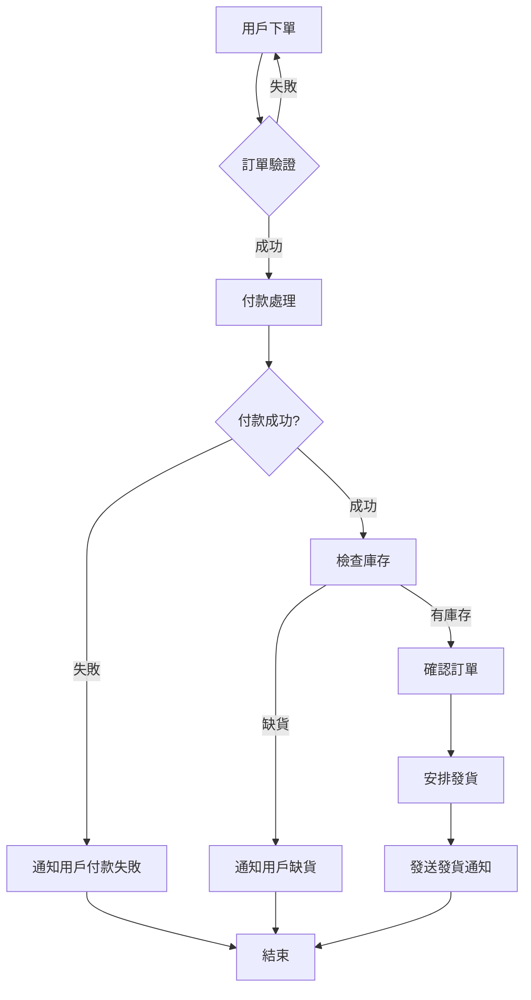
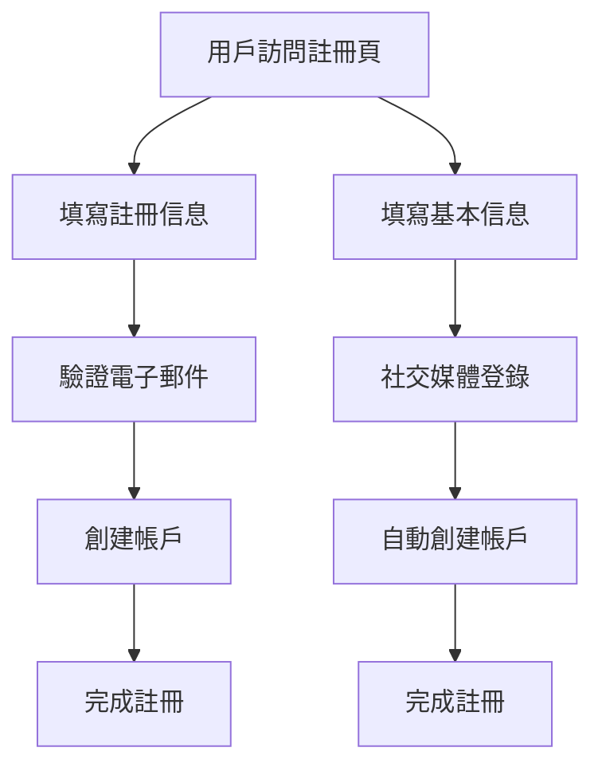
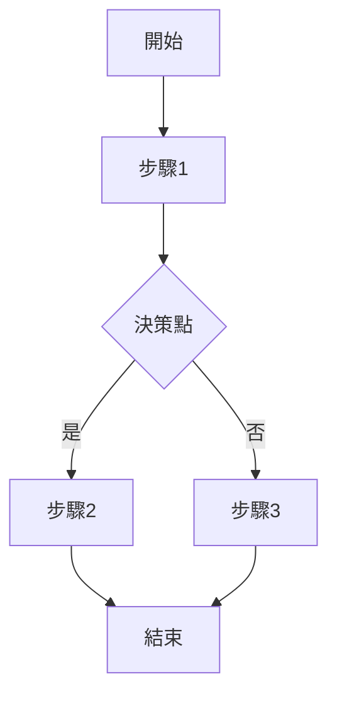

## 💡 核心能力

- **流程分析**：從需求中提取關鍵流程步驟
- **圖形化表示**：使用標準流程圖符號
- **多層次結構**：支援高層次概覽和詳細流程
- **互動式調整**：支援動態修改和優化流程

## 🎯 適用場景

- 需要視覺化業務流程
- 正在設計新功能的工作流程
- 需要向團隊解釋複雜流程
- 需要優化現有流程效率

## 📝 使用範例

### 範例 1：建立新功能流程圖

**用戶輸入**：
> 我想建立一個線上訂單處理流程，包含訂單接收、付款處理、庫存檢查和發貨通知

**技能輸出**：

### 範例 2：優化現有流程

**用戶輸入**：
> 我想優化現有的用戶註冊流程，減少步驟

**技能輸出**：

## 🛠️ 使用指南

### 最佳實踐

1. **明確流程起點和終點**：
   - 每個流程都應該有明確的開始和結束
   - 確保流程閉環或正確結束

2. **使用標準符號**：
   - 矩形：表示步驟或操作
   - 菱形：表示決策點
   - 圓形：表示開始/結束
   - 平行四邊形：表示輸入/輸出

3. **保持流程簡潔**：
   - 每層流程不超過 10 個步驟
   - 使用子流程處理複雜邏輯
   - 避免過多分支

4. **標註清晰**：
   - 每個步驟都有簡短描述
   - 決策點有明確的條件
   - 連接線有方向指示

5. **迭代優化**：
   - 先建立高層次流程
   - 再細化每個步驟
   - 根據反饋調整流程

### 錯誤示例

**錯誤輸入**：
> 建立一個流程圖

**原因**：
- 沒有描述具體流程
- 不清楚流程的起點和終點
- 沒有提供任何細節

**正確輸入**：
> 建立一個用戶登錄流程圖，包含輸入帳號密碼、驗證、顯示錯誤訊息和成功登錄

## 📊 輸出格式

技能輸出遵循 Mermaid 語法：

支援的符號：
- `A[文本]`：矩形
- `B{文本}`：菱形
- `C(文本)`：圓形
- `D[/文本/]`：平行四邊形
- `-->`：有向箭頭
- `---`：無向箭頭

## 🔗 相關技能

- [prd](prd.md)：定義產品需求和流程
- [user-story](user-story.md)：編寫用戶故事
- [feature-spec](feature-spec.md)：詳細功能規格
- [ux-design](ux-design.md)：設計用戶流程

## 💡 提示

- 描述流程時，先確定起點和終點
- 每個步驟使用簡短動詞短語
- 決策點使用問句
- 複雜流程可以分解為多個子流程
- 輸出後可以互動式修改

## 💬 交流

如果你有任何問題或建議，請隨時提出！
