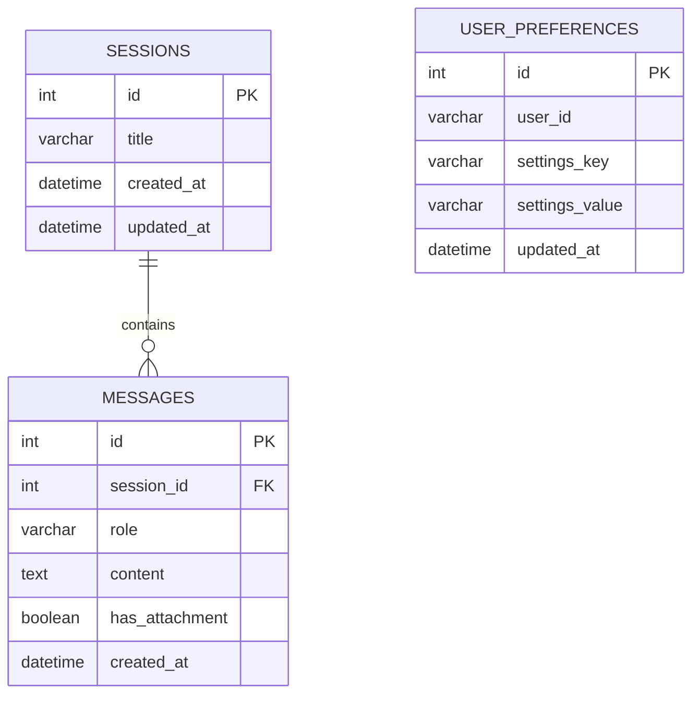

# 資料庫與資料模型設計：AI 聊天機器人 (AI Chatbot)

## 1. 資料實體 (Data Entities)

本系統採用的資料庫為 SQLite，對應 FastAPI 以 SQLAlchemy 作為 ORM 進行管理。核心實體分為以下三類：

### 會話 (Sessions)
作為獨立的聊天室，保存每次對話的上下文。
- `id` (PK): 會話的唯一識別碼 (Integer)
- `title`: 該次對話的標題 (String)
- `created_at`: 建立時間 (Datetime)
- `updated_at`: 最後活躍/更新時間 (Datetime)

### 訊息 (Messages)
保存每個會話內的對話紀錄與時序。
- `id` (PK): 訊息唯讀識別碼 (Integer)
- `session_id` (FK): 關聯的會話 ID (Integer)
- `role`: 發送者角色，如 `user` 或 `assistant` (String)
- `content`: 訊息的文字內容 (Text)
- `has_attachment`: 是否有夾帶上傳圖片或檔案 (Boolean)
- `created_at`: 訊息發送的精確時間戳 (Datetime)

### 偏好設定 (UserPreferences)
負責跨 Session 的持續性記憶與客製化設定紀錄。
- `id` (PK): 設定唯一值 (Integer)
- `user_id`: 使用者識別，因屬個人化系統可預設為 `default` (String)
- `settings_key`: 設定鍵名，例如 `language`、`tone` (String)
- `settings_value`: 設定對應值，例如 `zh-tw`、`humorous` (String)
- `updated_at`: 最後修改時間 (Datetime)

## 2. 實體關係圖 (ER Diagram)



## 3. SQLite 模型設計 (SQLAlchemy)

由於本專案後端規定使用 **FastAPI**，使用 **SQLAlchemy** 作為 Python 中對應 SQLite 的 ORM 建表模型最為契合：

```python
from sqlalchemy import Column, Integer, String, Text, Boolean, DateTime, ForeignKey
from sqlalchemy.orm import declarative_base, relationship
from datetime import datetime

Base = declarative_base()

class Session(Base):
    __tablename__ = 'sessions'
    
    id = Column(Integer, primary_key=True, autoincrement=True)
    title = Column(String(100), default="New Chat")
    created_at = Column(DateTime, default=datetime.utcnow)
    updated_at = Column(DateTime, default=datetime.utcnow, onupdate=datetime.utcnow)
    
    # 關聯：一個 Session 包含多個 Message
    # cascade 設定為全刪除，當聊天室被刪除時其對話自動銷毀
    messages = relationship("Message", back_populates="session", cascade="all, delete-orphan")

class Message(Base):
    __tablename__ = 'messages'
    
    id = Column(Integer, primary_key=True, autoincrement=True)
    session_id = Column(Integer, ForeignKey('sessions.id'), nullable=False, index=True)
    role = Column(String(20), nullable=False)  # 容許 'user', 'assistant', 'system'
    content = Column(Text, nullable=False)
    has_attachment = Column(Boolean, default=False)
    created_at = Column(DateTime, default=datetime.utcnow)
    
    # 關聯
    session = relationship("Session", back_populates="messages")

class UserPreference(Base):
    __tablename__ = 'user_preferences'
    
    id = Column(Integer, primary_key=True, autoincrement=True)
    user_id = Column(String(50), default="default_user", index=True)
    settings_key = Column(String(50), nullable=False)
    settings_value = Column(String(200), nullable=False)
    updated_at = Column(DateTime, default=datetime.utcnow, onupdate=datetime.utcnow)
```

## 4. 索引與效能優化設計

### 4.1 索引建置
雖然 SQLAlchemy 模型內已標註 `index=True`，轉換為 SQL 的觀念即為：
```sql
-- 提升讀取特定 Session 歷史對話的速度
CREATE INDEX idx_messages_session_id ON messages(session_id);

-- 提升讀取使用者偏好設定的速度
CREATE INDEX idx_user_preferences_user ON user_preferences(user_id);
```

### 4.2 串聯刪除 (Cascade Delete)
在 `Session` 與 `Message` 加入 `cascade="all, delete-orphan"`。當使用者於介面點擊「刪除當前聊天室」時，該 Session 與其關聯的所有 Message 會一併被 SQLite 抹除，防止孤兒資料堆積拖垮查詢效能。

### 4.3 正規化設計 (Normalization)
- **第一正規化 (1NF)**：資料庫不設計陣列或 JSON 複雜欄位儲存對話（即不將整串紀錄存成字串），而是獨立為 `Messages` 行，方便對單一語句提供編輯或重新生成 (Regenerate) 操作。
- **第二、第三正規化 (2/3NF)**：`Messages` 只依賴自己的 ID 並指向外鍵 `session_id`，移除了系統冗餘負擔。
